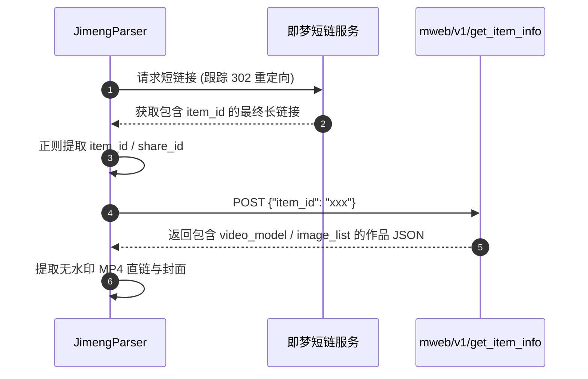

# 即梦 AI (Jimeng) 逆向解析指南

本篇详细记录字节跳动剪映旗下 **即梦 AI (jimeng.jianying.com)** 视频与图像生成的解析方案及接口细节。

---

## 1. 平台特征与支持能力

* **平台标识**：`即梦AI`
* **支持媒体类型**：
  * AI 生成高清视频 (MP4)
  * AI 生成图集 (PNG/JPEG)
  * 提示词文案 (Prompt) 与创作者昵称/头像
* **常见链接形态**：
  * 分享短链：`https://jimeng.jianying.com/s/rdloCrYi2wc/?t=8011`
  * 移动详情长链：`https://jimeng.jianying.com/ai-tool/share/item/7631885529415568665`
* **Cookie 依赖**：公开分享链接**无需配置 Cookie**。

---

## 2. 核心逆向流程



### 2.1 核心请求定义
* **接口地址**：
  `POST https://jimeng.jianying.com/mweb/v1/get_item_info`
* **请求头**：
  ```python
  headers = {
      "Accept": "application/json, text/plain, */*",
      "Content-Type": "application/json",
      "User-Agent": "Mozilla/5.0 (Windows NT 10.0; Win64; x64) ..."
  }
  ```
* **Payload 载荷**：
  ```json
  {
    "item_id": "7631885529415568665"
  }
  ```

---

## 3. 字段提取规则

* **视频直链**：从 `item_info.video.play_addr.url_list[0]` 或 `item_info.video_model.video_list[0].main_url` 获取。
* **生图图集**：从 `item_info.image_list` 提取高清渲染图。
* **Prompt 标题**：从 `item_info.title` 或 `item_info.prompt` 中提取。

---

## 4. 常见踩坑与注意事项

1. **短链参数丢失**：
   * 即梦短链（`/s/xxxx`）必须先发起一次带 `allow_redirects=True` 的 GET 请求，从重定向后的真实 URL 查询参数或路径中提取真正的 `item_id`。
2. **多清晰度选择**：
   * 接口返回的 `video_list` 可能包含预览低清流和渲染高清流，代码中已内置按分辨率倒序优先挑选最高清直链。

---

## 5. 测试与验证

* **单元测试**：[tests/test_jimeng_parser.py](file:///Users/leo/Projects/media-parser/tests/test_jimeng_parser.py)
* **执行测试**：
  ```bash
  pytest tests/test_jimeng_parser.py
  python tests/manual_verify_parsers.py --platform 即梦AI
  ```
