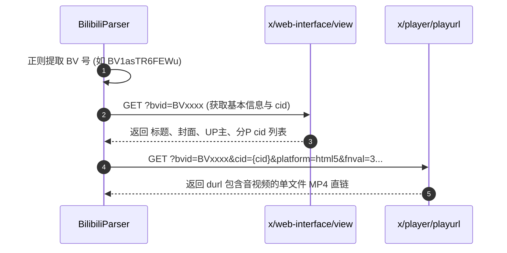

# 哔哩哔哩 (Bilibili) 逆向解析指南

本篇详细记录 B 站视频基本信息与可直接播放的单文件 MP4 播放流提取方案。

---

## 1. 平台特征与支持能力

* **平台标识**：`哔哩哔哩`
* **支持媒体类型**：
  * 高清视频流 (单文件 MP4)
  * 高清封面图 (Cover)
  * 视频标题与 UP 主作者信息
* **常见链接形态**：
  * 短链接：`https://b23.tv/xxxx`
  * 网页端长链：`https://www.bilibili.com/video/BV1asTR6FEWu`
* **Cookie 依赖**：无需登录 Cookie（可获取 720P/1080P HTML5 基础流）。

---

## 2. 核心逆向流程：双 API 联动

Bilibili 解析采用官方公开的 Web 开放接口进行两步联动查询：



### 2.1 步骤 1：获取视频详情与 `cid`
* **接口**：`https://api.bilibili.com/x/web-interface/view`
* **参数**：`bvid={bvid}`
* **产出**：获取视频的 `cid`（内容分块 ID）、`title`、`pic`（封面图）、`owner`（UP主）。

### 2.2 步骤 2：获取无需合成的单文件 MP4 流 (`PlayURL`)
* **接口**：`https://api.bilibili.com/x/player/playurl`
* **关键传参技巧（避开 DASH 音视频分离）**：
  ```python
  params = {
      "otype": "json",
      "fnver": 0,
      "fnval": 3,              # 避免默认返回 DASH 分离流
      "player": 3,
      "qn": 112,               # 请求高质量档位
      "bvid": self.bvid,
      "cid": cid,
      "platform": "html5",      # 指定 HTML5 平台
      "high_quality": 1
  }
  ```
* **数据提取**：直接从 `data.durl[0].url` 获取已合并音视频的完整 MP4 直链，免去服务器端调用 `ffmpeg` 转码的性能开销。

---

## 3. 常见踩坑记录 (Gotchas)

1. **DASH 格式音视频分流陷阱**：
   * 现代 B 站客户端默认使用 DASH（音轨与视轨分开为两个独立的 m4s 文件），如果直接提取会导致视频没有声音。
   * **解法**：如上述参数配置，强制指定 `platform=html5` 请求，B 站服务端会自动返回封装好的 Progressive MP4 单文件流。
2. **防盗链 (403 Forbidden)**：
   * 播放或下载 B 站视频直链时，客户端请求头中必须附带 `Referer: https://www.bilibili.com/`，否则会被 CDN 拦截。

---

## 4. 测试与验证

* **单元测试**：[tests/test_bilibili_parser.py](file:///Users/leo/Projects/media-parser/tests/test_bilibili_parser.py)
* **执行测试**：
  ```bash
  pytest tests/test_bilibili_parser.py
  python tests/manual_verify_parsers.py --platform 哔哩哔哩
  ```
