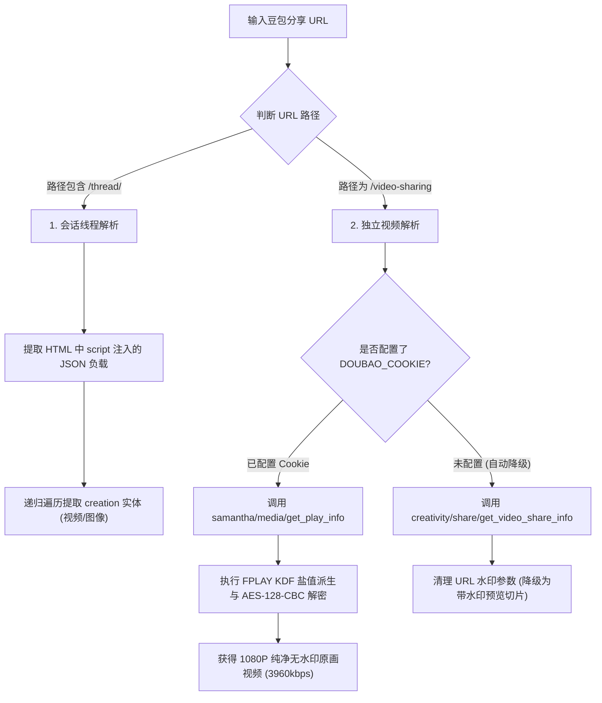

# 豆包 AI (Doubao) 逆向解析指南

本篇详细记录字节跳动旗下**豆包 AI** 对话分享（Thread）与独立视频生成分享（Video Sharing）的逆向解析方案、FPLAY 播放凭证解密与 Cookie 鉴权机制。

---

## 1. 平台特征与支持能力

* **平台标识**：`豆包`
* **支持媒体类型**：
  * AI 生成 1080P 高清无水印视频 (MP4)
  * AI 生成图文 / 提示词生图 (PNG/JPEG)
  * 对话标题、Prompt 提示词与创作者信息
* **常见链接形态**：
  * 独立视频分享：`https://www.doubao.com/video-sharing?share_id=41356597786354690&video_id=v0d69cg10004d6978e2ljht0i4fdpp00`
  * 对话历史/线程分享：`https://www.doubao.com/thread/w8293749281`
* **Cookie 依赖**：
  * **图片解析**：**无需 Cookie**（公开元数据直接包含 `image_ori_raw` 高清原图）。
  * **视频无水印解析**：**必须配置 Cookie**（1080P 原始流被权限隔离，未登录仅能获取服务端硬压制水印的预览切片）。

---

## 2. 核心逆向流程

[DoubaoParser](file:///Users/leo/Projects/media-parser/src/parsers/doubao_parser.py) 内部实现了双分支解析引擎与优雅降级策略：



---

## 3. 核心 API 与加密解密技术细节

### 3.1 核心 API 汇总
* **无水印高清媒体接口 (需鉴权)**：
  `POST https://www.doubao.com/samantha/media/get_play_info`
* **公开视频分享接口 (未登录降级用)**：
  `POST https://www.doubao.com/creativity/share/get_video_share_info`
* **模型资源接口**：
  `POST https://www.doubao.com/alice/resource/get_video_model`

### 3.2 FPLAY 播放流密钥派生 (KDF & AES 解密)
豆包的高清无水印视频源采用了字节跳动 **FPLAY 自定义加密流**。解析器内置了基于固定盐值的密钥派生与 AES-128-CBC 解密算法：
* **KDF Salt 盐值**：
  `TdTC5rgxYgkOUrPHpnM7pByyRiuCmrWKGWs521cXdST0m69/COjWjSanLjfBqVovHwWlGJKu8pSXMrYqOKrdWA==`
* **解密逻辑**：
  1. 通过 SHA256 与 Salt 派生出 AES Key 与 IV；
  2. 利用 `Crypto.Cipher.AES` 对 `get_play_info` 下发的密文字符串进行解密并去除 PKCS7 Padding；
  3. 解密后即可还原出官方原始 1080P MP4 直链（经验证，文件 MD5 与平台原始生成视频完全一致）。

---

## 4. 经典踩坑与逆向攻防复盘 (Case Study: Issue #14)

### 踩坑 1：URL 参数去水印的“假象”
* **初始误区**：在公开分享接口中，视频 URL 带有 `lr=video_gen_watermark_dyn`、`logo_type` 等参数。直觉上容易认为只要清洗掉这些 URL Query 参数就能去水印。
* **攻防真相**：豆包服务端对于未登录/公开状态的请求，**在服务器端转码切片时就已经将水印物理硬编码压制进了视频画面**。清洗 URL 参数无法改变视频底层的像素内容。
* **最终解法**：必须通过 `samantha/media/get_play_info` 鉴权接口提取 `original_media_info.main_url` 并完成 FPLAY 解密。

### 踩坑 2：图文与视频的鉴权隔离差异
* **图片无水印**：豆包在公开分享 HTML 中直接完整下发了 `image_ori_raw` 与 `image_ori` 原图直链，无需任何登录态即可提取无水印原图。
* **视频强鉴权**：未登录请求 `get_play_info` 会直接报 `login invalid`，因此视频无水印必须依赖登录态。

---

## 5. Cookie 配置最小指南

为避免用户复制过长且包含无关追踪标记的 Cookie，豆包仅需提取关键的身份凭据即可：

1. 打开浏览器访问 [豆包网页版](https://www.doubao.com/) 并登录。
2. 按 `F12` 打开开发者工具，在 **Application (应用程序) ➔ Cookies** 中找到核心认证字段：`sessionid_ss`。
3. 在项目根目录的 `.env` 文件中配置（两者格式均支持）：
   ```env
   # 精简格式 (推荐)
   DOUBAO_COOKIE="sessionid_ss=你的sessionid_ss值"
   
   # 或者完整 Cookie 字符串
   DOUBAO_COOKIE="sessionid_ss=xxx; passport_csrf_token=yyy; ..."
   ```

---

## 6. 测试与验证

* **单元测试**：[tests/test_doubao_parser.py](file:///Users/leo/Projects/media-parser/tests/test_doubao_parser.py)
* **执行测试**：
  ```bash
  pytest tests/test_doubao_parser.py
  python tests/manual_verify_parsers.py --platform 豆包
  ```
