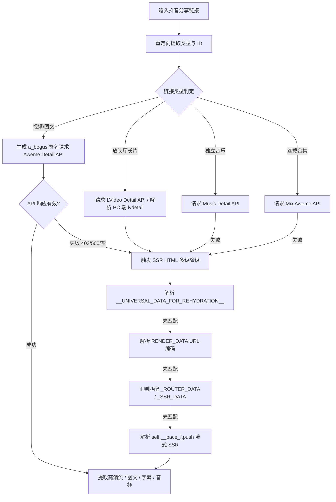

# 抖音 (Douyin) 逆向解析指南

本篇详细记录抖音平台短视频、图文笔记、LivePhoto 实况、独立音乐/原声、连载合集及原生 AI 字幕的完整逆向提取方案、签名机制、容灾降级策略及踩坑经验。

---

## 1. 平台特征与支持能力

* **平台标识**：`抖音`
* **支持媒体类型**：
  * 无水印高清视频 (智能码率排序，优先选取兼容性最好的 H.264 编码，无缝兼容 H.265/HEVC)
  * 放映厅 / 影视长片 / 连载短剧 (单集与全集列表 `video_list`，标题 `【放映厅】{album_name} - {episode_name}`)
  * 高清图文图集 (无水印原图)
  * 动态实况照片 (LivePhoto 动态视频流)
  * 背景音乐 / 独立原声 (Audio MP3)
  * 连载合集 / 短剧专题 (多分集视频列表 `video_list`)
  * 原生 AI 生成字幕 (WebVTT 格式，含多语言代码与字幕 ID)
* **常见链接形态**：
  * 短链接：`https://v.douyin.com/Nid-fFF_sdI/`
  * 网页端放映厅长片长链：`https://www.douyin.com/lvdetail/7677129845654061595`
  * 网页端视频长链：`https://www.douyin.com/video/7616399587141737704`
  * 网页端图文长链：`https://www.douyin.com/note/7616399587141737704`
  * 网页端独立音乐长链：`https://www.douyin.com/music/7123456789012345678`
  * 网页端合集长链：`https://www.douyin.com/collection/7123456789012345678`
* **Cookie 依赖**：
  * **普通作品 (99%)**：无需用户登录 Cookie，系统内置**动态 TTWID 游客凭证注册与缓存**，同时支持 **SSR 免签名容灾降级**。
  * **放映厅长片 (`/lvdetail/`)**：受字节跳动严格风控保护，需在环境变量或 `.env` 中配置 `DOUYIN_COOKIE`（仅需风控通行证 `s_v_web_id` 与 `__ac_nonce`，无需个人账号登录凭证）。

---

## 2. 链路追踪与 ID 提取

1. **302 重定向**：通过 `WebFetcher.fetch_redirect_url` 跟随短链 302 跳转至标准长链接，并保留 `ep_id`、`album_id` 等关键参数。
2. **ID 提取**：使用 `UrlParser.get_video_id` 自动从 `/video/`、`/note/`、`/music/`、`/collection/`、`/lvdetail/` 及 `ep_id` 参数匹配作品/分集 ID。

---

## 3. 核心逆向方案与多轨容灾机制

抖音解析采用 **API 签名优先 + SSR HTML 免签名多级容灾 + 流式 SSR (RSC) 深度解析** 的高可用架构。



### 3.1 核心请求定义
* **作品详情接口**：
  ```text
  https://www.douyin.com/aweme/v1/web/aweme/detail/?device_platform=webapp&aid=6383&channel=channel_pc_web&aweme_id={aweme_id}&msToken={ms_token}&a_bogus={a_bogus}
  ```
* **独立音乐详情接口**：
  ```text
  https://www.douyin.com/aweme/v1/web/music/detail/?music_id={music_id}&device_platform=webapp&aid=6383&channel=channel_pc_web&msToken={ms_token}&a_bogus={a_bogus}
  ```
* **合集作品列表接口**：
  ```text
  https://www.douyin.com/aweme/v1/web/mix/aweme/?mix_id={mix_id}&cursor=0&count=20&device_platform=webapp&aid=6383&channel=channel_pc_web&msToken={ms_token}&a_bogus={a_bogus}
  ```
* **放映厅长视频接口**：
  ```text
  https://api5-normal-c-hl.amemv.com/aweme/v1/lvideo/detail/?episode_id={ep_id}&album_id={album_id}&aid=1128
  ```
* **必备请求头**：
  * `User-Agent`：必须与签名计算时传入的 UA 严格一致（见 [BogusSigner](file:///Users/leo/Projects/media-parser/utils/signer/bytedance/bogus_signer.py)）。
  * `Referer`：对应页面 URL（例如 `https://www.douyin.com/video/{aweme_id}` 或 `https://www.douyin.com/lvdetail/{ep_id}`）。
  * `Cookie`：携带 `ttwid` 及自定义 `DOUYIN_COOKIE`。

### 3.2 动态 TTWID 获取机制
抖音 Web 端详情接口要求必须携带有效的 `ttwid`。我们在 [DouyinParser](file:///Users/leo/Projects/media-parser/src/parsers/douyin_parser.py) 中实现了自动注册与类级别内存缓存：
```python
url = "https://ttwid.bytedance.com/ttwid/union/register/"
data = {
    "region": "cn",
    "aid": 6383,
    "need_t": 1,
    "service": "www.douyin.com",
    "domain": ".douyin.com"
}
resp = session.post(url, json=data)
ttwid = resp.cookies.get('ttwid')
```

### 3.3 签名计算 (a_bogus)
通过 `py_mini_racer` 在 Google V8 引擎中执行提取的前端混淆脚本，计算 `a_bogus` 防篡改签名：
```python
from utils.signer.bytedance.bogus_signer import BogusSigner

signer = BogusSigner()
abogus = signer.get_abogus(play_url, signer.user_agent)
```

### 3.4 SSR HTML 免签名容灾降级与流式 SSR
当 API 遭遇风控（403/500/空数据）或面对放映厅长视频时，解析器自动回退到 SSR 页面数据抽取，覆盖 4 种主流结构：
1. `<script id="__UNIVERSAL_DATA_FOR_REHYDRATION__">`（现代 PC 网页端主流）；
2. `<script id="RENDER_DATA">`（经典版 URL 编码结构）；
3. 正则表达式捕获 `window._ROUTER_DATA` / `window._SSR_DATA` / `window.__INIT_PROPS__`；
4. **React Server Components 流式 SSR (`self.__pace_f.push`)**：解析 Next.js / 字节流式传输切片，提取包含 `defaultAwemeInfo`、`lvideoBrief`、`videoModel.dynamicVideo` 的超高清流。

---

## 4. 字段提取与核心规则

### 4.1 视频画质与编码智能优选
* **码率降序排序**：解析 `bit_rate` 或 `dynamic_video_list` 列表，按码率从大到小排列。
* **优先 H.264 编码 (`is_h265 == 0` / `codec_type == 'h264'`)**：优先选取 H.264 最高码率视频流（最高支持 1080p 6.46Mbps），避免 H.265/HEVC 导致 Web 浏览器前端 `<video>` 标签黑屏无画面；若无 H.264 则回退至最高画质 H.265。
* **源站 CDN 节点优选**：`url_list` 优先取第 3 个节点（`url_list[2]`，源站节点），为空时取第 1 个。

### 4.2 图文与 LivePhoto 提取
* ⚠️ **防坑警示**：`download_url_list` 包含带官方水印的图片；**必须提取 `url_list[-1]`**（末尾项通常为无水印最高清原图）。
* **LivePhoto 识别**：若单张图片对象包含 `img['video']['play_addr']`，提取该视频流作为实况动图文件。

### 4.3 原生 AI 字幕提取
从 `video.cla_info.caption_infos` 与 `video.subtitle_infos` 中提取标准 WebVTT/SRT 字幕流，自动发起轻量请求获取并结构化解析为带时间轴的片段数组（`[{"start": 0.64, "end": 2.12, "text": "..."}]`），直接对齐 ASR / 歌词数据契约。

### 4.4 连载合集与多分集视频列表
* 当传入 `/collection/{mix_id}` 合集链接时，提取全集列表并注入 `video_list`，首集作为 `video_url`；
* 标题自动规范为 `【合集】{mix_name}`，封面提取合集官方封面。

### 4.5 放映厅 / 影视长片 / 演唱会大片 (`/lvdetail/`)
* **剧集与直拍选集**：解析 `lvideoBrief.albumInfo` 与 `lvideoBrief.episodeInfo`，标题自动格式化为 `【放映厅】{album_name} - {episode_name}`；
* **超清音视频分离提取**：从 `videoModel.dynamicVideo` 提取最高清 H.264 视频流（`video_url`）与独立音轨（`audio_url`）；
* 💡 **关于「抖音独播/独家」画面角标**：部分独播影视与演唱会长片画面右上角会显示「抖音 独播」或「独家」标签，该角标属于官方源片入库转码时**硬编码（Burned-in）压制进视频每一帧画面中的电视台标式台标**（即使在官方 App 内离线缓存也是带标的），提取到的已是官方服务器存储的最高清原始片源。

---

## 5. 常见踩坑记录与风控解法 (Gotchas)

1. **TTWID 失效导致返回空详情**：
   * *现象*：接口 HTTP 状态码返回 200，但 JSON 中缺少 `aweme_detail` 字段。
   * *解法*：代码内置重试机制，初次失败立即清空 `_TTWID_CACHE` 并重新获取；若二次重试仍失败，自动降级至 SSR HTML 兜底。
2. **H.265 在 Web 端播放黑屏**：
   * *现象*：直接取 `bit_rate[0]` 可能是 H.265 编码，在 Chrome / Safari 播放时有声音无画面。
   * *解法*：代码中严格做 `is_h265 == 0` / `codec_type == 'h264'` 过滤，优先选择 H.264 最高码率流。
3. **放映厅长视频遭遇 TTGCaptcha 滑块拦截**：
   * *现象*：匿名请求放映厅链接时返回 6KB `<title>验证码中间页</title>`，官方接口返回 `{"status_code": 4, "status_msg": "啊哦，服务器打瞌睡了，再试一次吧～"}`。
   * *原因*：字节跳动对影视长片启用了严格的反爬滑块验证。
   * *解法*：配置环境变量 `DOUYIN_COOKIE`。**注意：无需暴露任何包含账号隐私的 `sessionid`**，经消融实验测试，**仅需提供以下两个非登录的风控通行证字段**即可 100% 成功解析：
     ```text
     DOUYIN_COOKIE="s_v_web_id=verify_xxx; __ac_nonce=xxx;"
     ```
     * `s_v_web_id`：字节跳动安全 SDK 人机校验通过凭证（Security Verify ID）；
     * `__ac_nonce`：安全网关挑战随机数（Anti-Crawler Nonce）。

---

## 6. 测试与验证

* **单元测试文件**：[tests/test_douyin_parser.py](file:///Users/leo/Projects/media-parser/tests/test_douyin_parser.py)
* **执行测试**：
  ```bash
  # 运行抖音专项全覆盖单元测试 (18 个用例)
  python -m unittest tests/test_douyin_parser.py
  
  # 运行全平台回归测试 (146 个用例)
  python -m unittest discover -s tests
  ```
