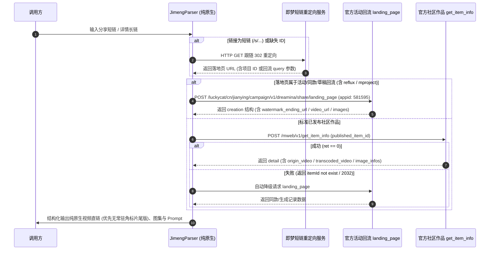

# 即梦 AI (Jimeng) 逆向解析指南

本篇详细记录字节跳动剪映旗下 **即梦 AI (jimeng.jianying.com)** 视频与图像生成的纯原生逆向解析方案、端点协议及字段清洗逻辑。

---

## 1. 平台特征与支持能力

* **平台标识**：`即梦AI`
* **架构定位**：**100% 官方原生逆向**（零第三方代解析 API、零浏览器驱动、零外部付费依赖）
* **支持媒体类型**：
  * **AI 生成视频** (MP4，支持片尾水印版/无常驻角标版、社区原画视频及多清晰度转码流)
  * **AI 生成图集** (PNG/JPEG 高清原图，分辨率最高达 4096)
  * **提示词文案** (Prompt 提示词、画面描述、创作者昵称与头像)
* **常见链接形态**：
  * 分享短链：`https://jimeng.jianying.com/s/ztE5KHEMB_g/?t=0`
  * 移动社区详情长链：`https://jimeng.jianying.com/ai-tool/share/item/7631885529415568665`
  * 同款/草稿/生成记录回流长链：`https://jimeng.jianying.com/activities/reflux/mproject?id=7683715084807376153&search_keyword=...`

---

## 2. 核心架构与原生双轨解析流程



---

## 3. 官方原生接口规范

### 3.1 活动回流端点 (Campaign Landing Page)
* **接口地址**：
  `POST https://jimeng.jianying.com/luckycat/cn/jianying/campaign/v1/dreamina/share/landing_page`
* **适用场景**：用户分享的同款生成、草稿、活动回流（短链 `https://jimeng.jianying.com/s/...` 重定向大多指向此类）。
* **请求头要求**：
  ```http
  Accept: application/json, text/plain, */*
  Content-Type: application/json
  appid: 581595
  User-Agent: Mozilla/5.0 (Windows NT 10.0; Win64; x64) ...
  ```
* **请求体 (JSON)**：
  ```json
  {
    "query_params": {
      "id": "7683715084807376153",
      "share_token": "...",
      "search_keyword": "..."
    },
    "item_id": "7683715084807376153"
  }
  ```
* **关键返回字段**：
  * `data.page_info.creation.metadata.download_info.watermark_ending_url`：官方提供的片尾水印版（主体画面无右上角常驻角标，仅最后片尾带 logo）。
  * `data.page_info.creation.metadata.video_url`：回流页直显视频流。
  * `data.page_info.creation.metadata.download_info.url`：下载流。
  * `data.page_info.creation.prompt`：AI 绘画/生视频的原始 Prompt。
  * `data.page_info.creation.image_list`：生图图集列表。

### 3.2 社区作品端点 (Mweb Get Item Info)
* **接口地址**：
  `POST https://jimeng.jianying.com/mweb/v1/get_item_info`
* **适用场景**：公开发布在即梦社区中的作品详情长链（如 `/ai-tool/share/item/...`）。
* **请求体 (JSON)**：
  ```json
  {
    "published_item_id": "7412345678901234567"
  }
  ```
* **关键返回字段**：
  * `data.video.origin_video.video_url`：原画视频直链。
  * `data.video.transcoded_video`：多档位转码流（包含 `origin`、`1080p`、`720p` 等）。
  * `data.image_infos`：生图高清多分辨率映射图。

---

## 4. 字段清洗与无常驻角标提取策略

1. **多流择优输出**：
   * 在回流页场景下，`download_info` 中官方同时返回了 `watermark_ending_url`（仅片尾水印，主体画面无角标）与 `url`（右上角常驻水印）。解析器优先将 `watermark_ending_url` 作为主视频 `video_url`，同时将所有官方流依次放入 `video_list` 供用户选择。
2. **防盗链与参数清洗**：
   * 自动清理 URL 中的 `lr` 防盗链控制参数与水印模式切换标记 `cd=0%7C0%7C1%7C3` -> `cd=0%7C0%7C0%7C3`。
3. **生图图集质量分级**：
   * 从 `cover_url_map` / `image_url_map` 中按 `original` -> `4096` -> `2400` -> `1080` -> `720` 的优先级择取最高画质原图。

---

## 5. 常见踩坑与注意事项

1. **同款项目 ID (`item_id`) 与社区作品 ID (`published_item_id`) 的区分**：
   * 同款/生成记录/草稿分享链接中的 `id` 是同款项目 ID。如果直接传给 `/mweb/v1/get_item_info` 接口，即梦服务端会返回 `itemId not exist`（错误码 2032）。解析器内置了双轨路由与自动降级机制，确保两类链接均可 100% 成功解析。
2. **URL 规范化中的 Query 参数保留**：
   * 回流接口依赖短链重定向后带有的 Query 参数（如 `share_token`、`search_keyword` 等）。在 `UrlParser.extract_video_address` 中针对即梦 AI 开启了关键参数保留。

---

## 6. 测试与验证

* **单元测试**：[tests/test_jimeng_parser.py](file:///Users/leo/Projects/media-parser/tests/test_jimeng_parser.py)
* **执行测试**：
  ```bash
  python3 -m unittest tests/test_jimeng_parser.py
  python3 -m unittest discover tests/
  ```
