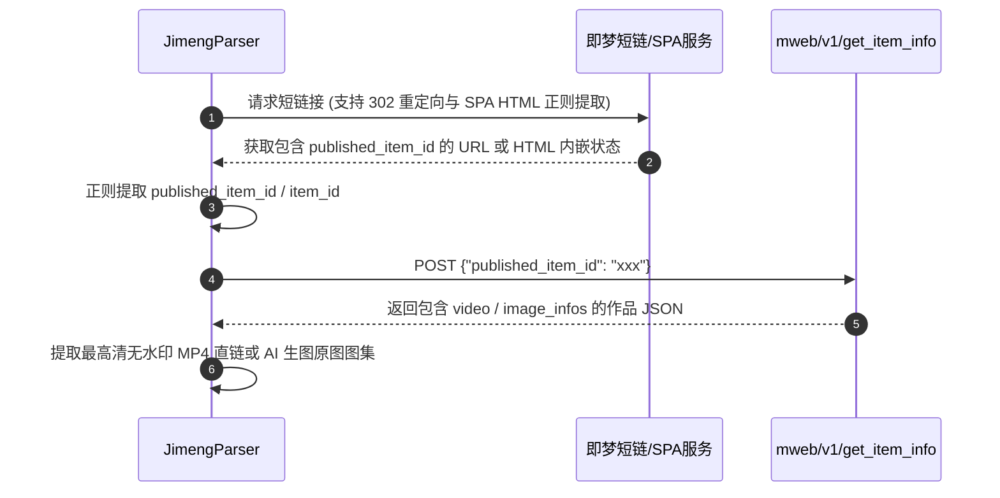

# 即梦 AI (Jimeng) 逆向解析指南

本篇详细记录字节跳动剪映旗下 **即梦 AI (jimeng.jianying.com)** 视频与图像生成的解析方案及接口细节。

---

## 1. 平台特征与支持能力

* **平台标识**：`即梦AI`
* **支持媒体类型**：
  * AI 生成高清视频 (MP4)
  * AI 生成图集 (PNG/JPEG)
  * 提示词文案 (Prompt) 与创作者昵称/头像
* **常见链接形态**：
  * 分享短链：`https://jimeng.jianying.com/s/rdloCrYi2wc/?t=8011`
  * 移动详情长链：`https://jimeng.jianying.com/ai-tool/share/item/7631885529415568665`
* **Cookie 依赖**：公开分享链接**无需配置 Cookie**。

---

## 2. 核心逆向流程



### 2.1 核心请求定义
* **接口地址**：
  `POST https://jimeng.jianying.com/mweb/v1/get_item_info`
* **请求头**：
  ```python
  headers = {
      "Accept": "application/json, text/plain, */*",
      "Content-Type": "application/json",
      "User-Agent": "Mozilla/5.0 (Windows NT 10.0; Win64; x64) ..."
  }
  ```
* **Payload 载荷**：
  ```json
  {
    "published_item_id": "7631885529415568665"
  }
  ```

---

## 3. 字段提取规则

* **视频直链**：优先提取 `video.transcoded_video` 中最高分辨率无水印直链，次选 `video.origin_video.video_url`。
* **生图图集**：从 `detail.image_infos` / `detail.image_list` 提取各档位（`original` / `4096` / `2400` / `1080`）最高清原图直链。
* **Prompt 标题**：从 `common_attr.title` 或 `common_attr.description` 中提取。

---

## 4. 常见踩坑与注意事项

1. **短链 SPA 页面无 302 重定向**：
   * 即梦部分移动端或 SPA 短链（如 `/s/xxxx/?t=210`）直接返回 HTML。解析器内置了双重提取策略：优先跟随 HTTP 302 重定向；若未重定向，则自动解析 HTML 中的 `window.__INITIAL_DATA__` 或 `published_item_id` 正则，确保 100% 提取到作品 ID。
2. **多清晰度选择**：
   * 接口返回的 `transcoded_video` 包含多档分辨率，代码中已内置按分辨率与码率倒序挑选最高画质。
3. **AI 生图作品支持**：
   * 即梦不仅生成视频，也支持图像创作。当作品为纯图片时，解析器会自动将高清原图提取为 `image_list`，避免误判为空。

---

## 5. 测试与验证

* **单元测试**：[tests/test_jimeng_parser.py](file:///Users/leo/Projects/media-parser/tests/test_jimeng_parser.py)
* **执行测试**：
  ```bash
  pytest tests/test_jimeng_parser.py
  python tests/manual_verify_parsers.py --platform 即梦AI
  ```
