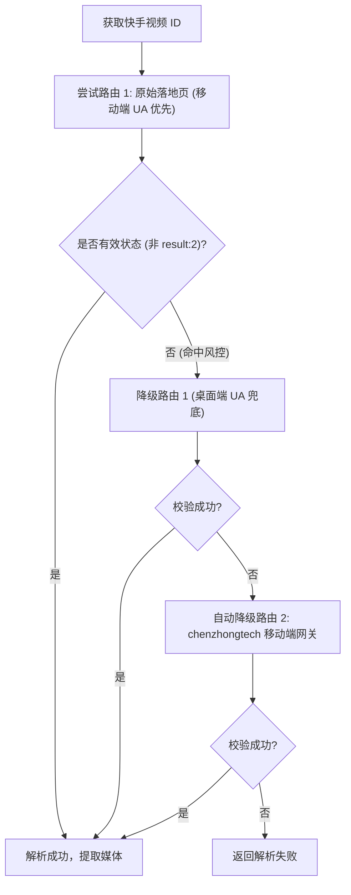

# 快手 (Kuaishou) 逆向解析指南

本篇详细记录快手短视频、图文图集（ATLAS）的多路由容灾抓取机制与防封策略。

---

## 1. 平台特征与支持能力

* **平台标识**：`快手`
* **支持媒体类型**：
  * 无水印高清短视频 (MP4)
  * 高清图文图集 (ATLAS 图集)
  * 背景音乐音频 (Audio)
* **常见链接形态**：
  * App 短链：`https://v.kuaishou.com/xxxx`
  * 移动端 H5 落地页：`https://v.m.chenzhongtech.com/fw/photo/3xbr5pi8hxi4e6s`（含 `*.m.chenzhongtech.com` 随机子域名）
  * PC 网页长链：`https://www.kuaishou.com/short-video/3xbr5pi8hxi4e6s`
* **Cookie 依赖**：无需用户登录，解析器已内置经过脱敏的高权重游客签名 Cookie。

---

## 2. 核心逆向方案：双端多路由 Fallback 容灾

快手不同公开路由的封控力度和可用性波动较大。在 [KuaishouParser](file:///Users/leo/Projects/media-parser/src/parsers/kuaishou_parser.py) 中，我们设计了**双端请求与多路由自适应降级重试机制**：



### 2.1 候选路由构建 (`_candidate_urls`)
* 优先使用 302 重定向后的原生落地页（兼容快手随机生成的 `*.m.chenzhongtech.com` 泛子域名）。
* 备用使用移动端专用解析网关：`https://v.m.chenzhongtech.com/fw/photo/{video_id}`。

### 2.2 风控识别与双端 UA 请求策略
* **桌面端封控拦截**：快手对桌面端请求风控严格，使用桌面端 User-Agent 请求极易返回 `{"result": 2, "error_msg": null}` 的 63 字节阻断 JSON。
* **移动端优先策略**：移动端 User-Agent 能够稳定获取约 186KB 的完整 HTML 页面数据（挂载在 `window.INIT_STATE`）。因此解析器采用**移动端 User-Agent 优先请求，桌面端 User-Agent 携带 Cookie 作为兜底**的设计。
* **风控熔断**：解析器通过 `_is_blocked_payload` 识别 `result == 2` 阻断响应，一旦命中立即触发备用通道。

---

## 3. 数据提取规则

### 3.1 数据载体双模兼容 (Apollo vs INIT_STATE)
快手不同版本与端的数据挂载方式不同，解析器通过 `_identify_and_parse_data` 实现了双模自动识别：
* **新版移动端载体 (`window.INIT_STATE`)**：移动端 H5 页面的标准格式，数据为嵌套的 `photo` 字典结构。
* **旧版/PC 载体 (`window.__APOLLO_STATE__`)**：PC 端页面格式，数据扁平挂载在 `defaultClient` 树下。

### 3.2 视频数据提取
* **新版字段 (`mainMvUrls`)**：优先从 `photo.mainMvUrls`（数组格式）提取高质量无水印直链：
  ```python
  video_url = photo.get('mainMvUrls', [{}])[0].get('url')
  ```
* **旧版字段 (`photoUrl`)**：兼容旧版 Apollo 树下的 `VisionVideoDetailPhoto:{video_id}.photoUrl` 字符串。
* **流媒体备用**：从流媒体清单 `manifest.adaptationSet` 中提取备用流或 m3u8 切片。

### 3.3 图集 (ATLAS) 提取
* 快手图文内容在数据结构中标识为 `ATLAS`，图片 CDN 列表位于 `photo.atlas.list` 或 `ext_params.atlas`。
* 遍历图片路径列表，优先选择 WebP 高清格式，并结合 CDN 域名（`atlas.cdn` / `atlas.cdnList`）拼接完整大图 URL。

---

## 4. 常见踩坑记录 (Gotchas)

1. **User-Agent 导致的风控差异**：
   * 桌面端 UA 会触发返回仅 63 字节的 `{"result":2}` 拦截响应；必须伪装真实的移动端 UA 才能稳定获取完整 180KB+ 页面。
2. **数据载体与结构变迁**：
   * 快手已从旧版 Apollo 状态机转向 `window.INIT_STATE`，视频字段从单一 `photoUrl` 变为 `mainMvUrls` 数组，需做好双向兼容。
3. **随机跳转域名**：
   * 短链重定向可能会跳转到 `*.m.chenzhongtech.com` 随机子域名，需基于 `video_id` 规范化构建候选路由。
4. **IP 访问频率限制**：
   * 在移动端路由中必须伪装成真实的移动端浏览器 Headers（如 `v.m.chenzhongtech.com` 的专用 Referer）。

---

## 5. 测试与验证

* **单元测试**：[tests/test_kuaishou_parser.py](file:///Users/leo/Projects/media-parser/tests/test_kuaishou_parser.py)
* **执行命令**：
  ```bash
  pytest tests/test_kuaishou_parser.py
  python tests/manual_verify_parsers.py --platform 快手
  ```
