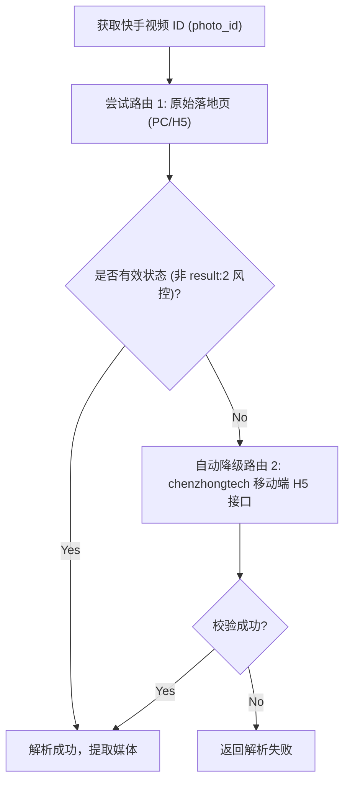

# 快手 (Kuaishou) 逆向解析指南

本篇详细记录快手短视频、图文图集（ATLAS）的多路由容灾抓取机制与防封策略。

---

## 1. 平台特征与支持能力

* **平台标识**：`快手`
* **支持媒体类型**：
  * 无水印高清短视频 (MP4)
  * 高清图文图集 (ATLAS 图集)
  * 背景音乐音频 (Audio)
* **常见链接形态**：
  * App 短链：`https://v.kuaishou.com/xxxx`
  * 移动端 H5 落地页：`https://v.m.chenzhongtech.com/fw/photo/3xbr5pi8hxi4e6s`
  * PC 网页长链：`https://www.kuaishou.com/short-video/3xbr5pi8hxi4e6s`
* **Cookie 依赖**：无需用户登录，解析器已内置经过脱敏的高权重游客签名 Cookie。

---

## 2. 核心逆向方案：双端多路由 Fallback 容灾

快手不同公开路由的封控力度和可用性波动较大。在 [KuaishouParser](file:///Users/leo/Projects/media-parser/src/parsers/kuaishou_parser.py) 中，我们设计了**多路由自适应降级重试机制**：



### 2.1 候选路由构建 (`_candidate_urls`)
* 优先使用 302 重定向后的原生落地页。
* 备用使用移动端专用解析网关：`https://v.m.chenzhongtech.com/fw/photo/{video_id}`。

### 2.2 风控识别与拦截检测
当快手触发安全拦截时，接口或页面通常直接返回 `{"result": 2}` JSON 负载。解析器通过 `_is_blocked_payload` 自动拦截此类响应并立即触发备用通道。

---

## 3. 数据提取规则

### 3.1 视频数据提取
* 优先从 `mainMvUrls` 中提取高质量直链：
  ```python
  video_url = photo.get('mainMvUrls', [{}])[0].get('url')
  ```
* 备用从流媒体清单 `manifest` 中提取。

### 3.2 图集 (ATLAS) 提取
* 快手图文内容在数据结构中标识为 `ATLAS`，图片 CDN 列表位于 `photo.atlas.list`。
* 遍历列表并结合 CDN 域名拼接最高清无水印大图。

---

## 4. 常见踩坑记录 (Gotchas)

1. **PC 端与移动端结构差异巨大**：
   * PC 端页面数据挂载在 `defaultClient` 树下；移动端直接返回 `photo` 结构。解析器必须做形态判断。
2. **IP 访问频率限制**：
   * 在移动端路由中必须伪装成真实的移动端浏览器 Headers（如 `v.m.chenzhongtech.com` 的专用 Referer）。

---

## 5. 测试与验证

* **单元测试**：[tests/test_kuaishou_parser.py](file:///Users/leo/Projects/media-parser/tests/test_kuaishou_parser.py)
* **执行命令**：
  ```bash
  pytest tests/test_kuaishou_parser.py
  python tests/manual_verify_parsers.py --platform 快手
  ```
