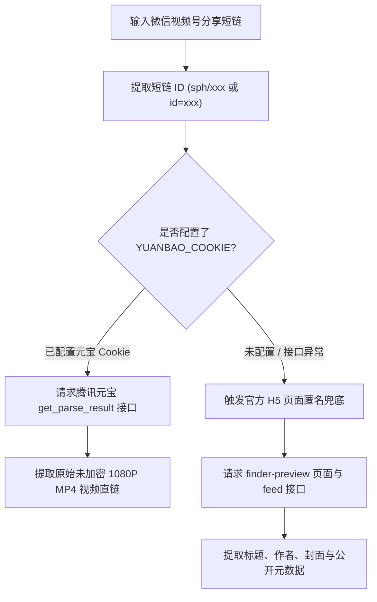

# 微信视频号 (WeChat Channels) 逆向解析指南

本篇详细记录 **微信视频号** 分享短链的解析方案。

---

## 1. 平台特征与支持能力

* **平台标识**：`视频号` / `微信视频号`
* **支持媒体类型**：无水印短视频 (MP4) / 封面图 / 创作者昵称
* **常见链接形态**：
  * 视频号短链：`https://weixin.qq.com/sph/AzGrUgqzFv`
* **Cookie 依赖**：
  * **公开基础信息 (标题/作者/封面)**：**无需 Cookie**（匿名请求官方 Finder Preview H5 页面即可提取）。
  * **完整高清视频提取**：由于微信官方对视频流进行了重度 DRM 加密，系统采用**腾讯元宝接口代理**方案，需在 `.env` 中配置 `YUANBAO_COOKIE`。
  * ⚠️ **隐私提示**：`YUANBAO_COOKIE` 包含腾讯元宝平台个人账号的会话凭证（`hy_user` 与 `hy_token`），属于**个人账号登录隐私凭证**，**强烈建议使用闲置小号**进行配置。

---

## 2. 核心逆向流程与双轨架构



### 2.1 核心 API
* **腾讯元宝视频号代解析接口 (需鉴权)**：
  `POST https://yuanbao.tencent.com/api/weixin/get_parse_result`
* **微信视频号官方 H5 预览页 (匿名公开)**：
  `https://channels.weixin.qq.com/finder-preview/pages/sph?id={short_id}`

---

## 3. Cookie 配置指南

1. 打开浏览器访问 [腾讯元宝网页版](https://yuanbao.tencent.com/) 并登录账号（建议使用小号）。
2. 按 `F12` 打开开发者工具，在 **Application ➔ Cookies** 中提取核心登录凭证：`hy_user` 与 `hy_token`。
3. 在 `.env` 中配置：
   ```env
   YUANBAO_COOKIE="hy_user=你的hy_user值; hy_token=你的hy_token值"
   ```

---

## 4. 测试与验证

* **单元测试**：[tests/test_wechat_channels_parser.py](file:///Users/leo/Projects/media-parser/tests/test_wechat_channels_parser.py)
* **执行命令**：`pytest tests/test_wechat_channels_parser.py`
