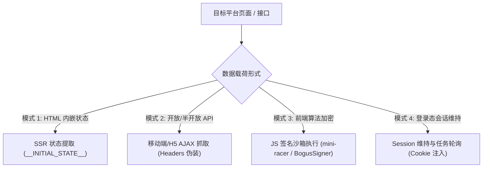

# 通用逆向方法论与抓包排查指南 (Reverse Engineering Guide)

本文档归纳了多媒体平台逆向解析的核心技术范式、抓包排查标准操作程序（SOP）以及常见反爬机制的应对策略。

---

## 🎯 4 大通用逆向技术范式

在分析 30+ 平台的过程中，我们将主流的解析方案归纳为以下 4 种模式：



### 模式 1：SSR 页面状态注入提取 (Server-Side Rendering)
* **适用平台**：小红书、最右、部分知乎/微博页面。
* **原理**：现代前端框架（Vue/React）在服务端渲染时，会将页面首屏的完整 JSON 序列化注入在 HTML 的 `<script>` 标签内（如 `window.__INITIAL_STATE__`、`window._ROUTER_DATA`）。
* **提取套路**：
  ```python
  import re, json
  # 使用正则非贪婪或贪婪匹配 script 块中的 JSON
  pattern = re.compile(r'window\.__INITIAL_STATE__\s*=\s*(\{.*?\});</script>', re.DOTALL)
  match = pattern.search(html_content)
  if match:
      data = json.loads(match.group(1))
  ```

---

### 模式 2：移动端 / H5 AJAX 接口抓取与伪装
* **适用平台**：快手、皮皮虾、AcFun、Bilibili。
* **原理**：PC 网页端通常反爬较严，但平台的移动端分享落地页（H5 / 微信内分享页）为了兼容性和加载速度，往往使用结构更简洁、校验更宽松的 AJAX REST API。
* **关键策略**：
  1. 切换 User-Agent 为移动端（如 iPhone Safari / Android Chrome）。
  2. 构造平台要求的 `Referer` 来源头（很多平台会验证 Referer 防盗链）。
  3. 去除无用的 App 专有设备指纹字段。

---

### 模式 3：JS 签名解密与 V8 沙箱执行 (`mini-racer`)
* **适用平台**：字节跳动系（抖音、西瓜、汽水音乐等）。
* **原理**：平台在前端通过混淆的 JavaScript 脚本计算请求签名（如 `a_bogus`、`x_bogus`、`msToken`），后端校验该签名以阻止未经授权的自动化爬取。
* **工程解法**：
  * 使用 [py_mini_racer](https://github.com/sqreen/py-mini-racer) 在 Python 中内嵌轻量级 Google V8 引擎。
  * 提取并脱敏原始 JS 签名逻辑至 [utils/signer/bytedance/](file:///Users/leo/Projects/media-parser/utils/signer/bytedance/)。
  * 通过 Python 直接向 V8 实例传入 URL query 与 UA 计算签名：
  ```python
  from utils.signer.bytedance.bogus_signer import BogusSigner
  signer = BogusSigner()
  abogus = signer.get_abogus(play_url, user_agent)
  ```

---

### 模式 4：登录态维持与异步任务轮询
* **适用平台**：豆包 AI、通义千问等大模型生成平台。
* **原理**：AI 生成视频或富文本内容依赖用户 Session，且视频生成通常是异步任务。
* **工程解法**：
  * 通过环境变量（如 `DOUBAO_COOKIE`）注入有效 Cookie。
  * 在 Session 请求头中带上身份鉴权凭证。
  * 轮询或从分享会话（Share Session）中提取已完成的任务直链。

---

## 🛠️ 抓包与排障 SOP (Standard Operating Procedure)

当某个平台解析失效或新增平台支持时，按以下 SOP 进行抓包分析：

### 第一步：链路重定向分析
使用 `curl -I` 观察分享短链接的跳转链路，获取最终真实 URL：
```bash
curl -I "https://v.douyin.com/xxxx/"
# 重点观察 HTTP 302 / 301 中的 Location 头部
```

### 第二步：浏览器 DevTools 抓包
1. 打开 Chrome 开发者工具 (`F12`)，勾选 **Preserve log (保留日志)** 与 **Disable cache (停用缓存)**。
2. 切换设备仿真为 **iPhone 14 Pro** 或 **Pixel 7**。
3. 粘贴短链接回车，在 Network 标签页过滤：
   * **Fetch/XHR**：观察页面加载完成后异步发出的数据请求。
   * **Media**：观察加载的视频流地址（`.mp4`, `.m3u8`, `blob:`）。
   * **Doc**：如果是 SSR 页面，右键查看首屏 Doc 响应源码，搜索视频标题关键词。

### 第三步：接口最小化提纯 (Header Stripping)
抓取到目标 API 请求后，右键选择 **Copy as cURL**，逐步剔除 Headers，找出哪些是**不可或缺的鉴权头**：
* 必须保留：通常为 `User-Agent`、`Referer`、特定 Cookie（如 `ttwid`）。
* 可以剔除：大部分 `sec-ch-ua`、`Sec-Fetch-*` 等浏览器指纹头。

---

## 🛡️ 常见反爬对抗与避坑技巧

| 反爬特征 | 表现形式 | 解决方案 |
| :--- | :--- | :--- |
| **IP 频控限制** | 连续请求后返回 403 / 429 或滑动验证码 | 增加 Session 复用，设置重试间隔；必要时配置代理池。 |
| **Cookie 过期** | 接口返回 `login required` 或空数据 | 动态向平台注册游客凭证（如抖音 `ttwid` 动态获取接口并做本地缓存）。 |
| **防盗链 (Hotlinking)** | 视频直链直接打开报 403 Forbidden | 下载或播放时必须在请求头中携带对应的平台 `Referer`。 |
| **水印 URL 替换** | 官方返回带水印的播放地址 | 分析 URL 结构，进行模式替换（如将 `playwm` 替换为 `play`，或取 CDN 列表最后一项）。 |
